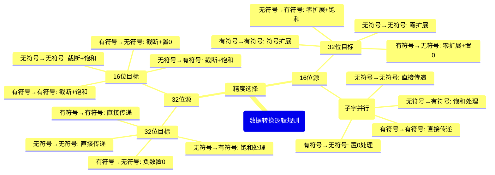

# INTtoINT 模块设计规格文档

> Author: [Oliver]  
> Editor: [Oliver]  
> Date: 2025-8-30  
> Version: 1.0  

## 1 概述

### 1.1 模块功能

INTtoINT模块实现整数到整数的类型转换功能，支持16位和32位的有符号或无符号整数转换为16位和32位的有符号或无符号整数。

### 1.2 设计目标

- 支持 signed/unsigned_INT16/32 到 signed/unsigned_INT16/32 的转换
- 实现子字并行处理能力
- 提供饱和处理机制
- 正确处理特殊值和边缘值

### 1.3 核心功能

- **16bit ↔ 32bit**: 支持16位和32位整数之间的双向转换
- **有符号 ↔ 无符号**: 支持有符号和无符号整数之间的转换
- **子字并行**: 真正的子字并行处理能力
- **饱和处理**: 当转换结果超出目标类型范围时进行饱和处理

## 2 接口规格

### 2.1 顶层模块接口

```verilog
module int_to_int_array
(
    input clk,                  // 时钟输入
    input rst_n,                // 低有效复位

    input wire [127:0] dvr_inttoint_s_in,    // 输入数据寄存器
    input wire [6:0]   cru_inttoint_in,      // 上行指令寄存器
    output reg [127:0] dr_inttoint_d_out     // 输出数据寄存器
);
```

### 2.2 信号定义

| 信号名称 | 位宽 | 方向 | 描述 |
|---------|------|------|------|
| clk | 1 | 输入 | 时钟输入 |
| rst_n | 1 | 输入 | 低有效复位 |
| dvr_inttoint_s_in | 128 | 输入 | 输入数据寄存器 |
| cru_inttoint_in | 7 | 输入 | 上行指令寄存器 |
| dr_inttoint_d_out | 128 | 输出 | 输出数据寄存器 |

### 2.3 微指令接口

| 信号名称 | 位宽 | 方向 | 描述 |
|---------|------|------|------|
| inst_vld | 1 | 输入 | 指令有效信号 |
| src_prec | 1 | 输入 | 源精度：0=INT16, 1=INT32 |
| dst_prec | 1 | 输入 | 目的精度：0=INT16, 1=INT32 |
| src_signed | 1 | 输入 | 源数据符号位：0=无符号，1=有符号 |
| dst_signed | 1 | 输入 | 目的符号位：0=无符号，1=有符号 |
| src_pos | 1 | 输入 | 源数据位置：0=低位, 1=高位 |
| dst_pos | 1 | 输入 | 目的数据位置：0=低位, 1=高位 |

## 3 功能规格

### 3.1 核心模块

1. **intto_int.v**: 基础INTtoINT计算单元
   - 支持一个源寄存器到目的寄存器的转换
   - 包含完整的类型转换逻辑和饱和处理
   - 纯组合逻辑实现，零延迟

2. **intto_int_array.v**: INTtoINT阵列模块
   - 包含4个并行的INTtoINT单元
   - 统一的微指令控制接口
   - 支持并行处理4路数据

### 3.2 数据转换逻辑规则



### 3.2.1 精度转换规则

| 源精度 | 目标精度 | 转换类型 | 处理方式 |
|--------|----------|----------|----------|
| 32位 | 32位 | 同精度转换 | 直接传递或符号性转换 |
| 32位 | 16位 | 降精度转换 | 截断并处理溢出 |
| 16位 | 32位 | 升精度转换 | 符号扩展或零扩展 |
| 16位 | 16位 | 子字并行 | 高低16位独立处理 |

### 3.2.2 符号性转换规则

| 源符号 | 目标符号 | 转换规则 |
|--------|----------|----------|
| 有符号 | 有符号 | 直接传递，处理溢出 |
| 有符号 | 无符号 | 负数置0，正数直接传递 |
| 无符号 | 有符号 | 值超过有符号范围则饱和 |
| 无符号 | 无符号 | 直接传递 |

### 3.2.3 溢出处理规则

- **有符号正溢出**：饱和到最大值 (0x7FFF for 16bit, 0x7FFFFFFF for 32bit)
- **有符号负溢出**：饱和到最小值 (0x8000 for 16bit, 0x80000000 for 32bit)
- **无符号正溢出**：饱和到最大值 (0xFFFF for 16bit, 0xFFFFFFFF for 32bit)
- **无符号负溢出**：饱和到0

### 3.2.4 位置处理规则

- **源位置**：仅对16位源数据有效，决定使用输入寄存器的高16位还是低16位
- **目标位置**：仅对16位目标数据有效，决定结果放置在输出寄存器的高16位还是低16位

## 4 数据范围

### int16 (16位整数)

| 类型 | 最小值 | 最大值 | 十六进制范围 | 十进制范围 |
|------|--------|--------|--------------|------------|
| **有符号(int16_t)** | -32,768 | 32,767 | 0x8000 - 0x7FFF | -2¹⁵ to 2¹⁵-1 |
| **无符号(uint16_t)** | 0 | 65,535 | 0x0000 - 0xFFFF | 0 to 2¹⁶-1 |

### int32 (32位整数)

| 类型 | 最小值 | 最大值 | 十六进制范围 | 十进制范围 |
|------|--------|--------|--------------|------------|
| **有符号(int32_t)** | -2,147,483,648 | 2,147,483,647 | 0x80000000 - 0x7FFFFFFF | -2³¹ to 2³¹-1 |
| **无符号(uint32_t)** | 0 | 4,294,967,295 | 0x00000000 - 0xFFFFFFFF | 0 to 2³²-1 |

## 5 验证规格

- 行覆盖率：100%
- 条件覆盖率：≥95%
- 翻转覆盖率：≥95%

## 6 文档交付

### 6.1 文件结构

```markdown
vsrc/
├── int_to_int.v              # 基础INTtoINT单元
├── int_to_int_array.v        # 4单元INTtoINT阵列
├── tb_int_to_int.v           # 基础单元测试平台
└── tb_int_to_int_array.v     # 阵列测试平台

csrc/
└── int_to_int_dpi.c          # DPI-C参考实现和验证函数

run_sim.sh                    # 仿真脚本
```

### 6.2 验证文档

- 测试计划与用例
- 覆盖率报告
- 仿真波形
- 时序分析报告
- 测试日志文件

### 6.3 测试覆盖范围

#### 基础单元测试 (tb_int_to_int.v)

- 32bit到32bit转换
- 16bit到32bit转换
- 32bit到16bit转换（含饱和处理）
- 16bit到16bit转换（子字并行）
- 有符号到无符号转换
- 无符号到有符号转换
- 指令有效/无效控制
- 数据位置处理

#### 阵列测试 (tb_int_to_int_array.v)

- 4单元并行转换验证
- 统一控制信号验证
- 并行数据处理
- 阵列级指令控制

## 7 快速上手

```markdown
# 1. 获取文件
vsrc/
├── int_to_int.v              # 基础INTtoINT单元
├── int_to_int_array.v        # 4单元INTtoINT阵列
├── tb_int_to_int.v           # 基础单元测试平台
└── tb_int_to_int_array.v     # 阵列测试平台

csrc/
└── int_to_int_dpi.c          # DPI-C参考实现和验证函数

run_sim.sh                    # 仿真脚本

# 2. 一键运行

chmod +x run_sim.sh           # 给脚本执行权限
./run_sim.sh unit             # 运行基础单元测试
./run_sim.sh array            # 运行阵列测试
./run_sim.sh all              # 运行所有测试

# 3. 查看结果
sim_output\
├── coverage_report\          
│└── dashboard.html           # 覆盖率报告
├── int_to_int_array_test.log # 测试日志
└── int_to_int_test.log       # 测试日志
```

## 版本历史

- **V1.0**: 初始版本，支持基本的INTtoINT转换功能
