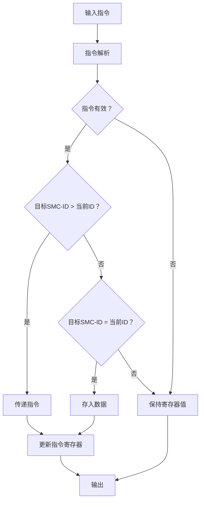

# SHIFT_DN 模块设计规格文档

>**文档版本**：V1.0  
>**作者**：Oliver  
>**创建日期**：2025年8月16日  
>**最后更新**：2025年8月16日  

## 1. 概述

### 1.1 模块功能

SHIFT_DN 模块是一个用于处理下行指令和数据的分发系统组件，实现指令的分发和指定 SMC 的更新功能。

### 1.2 设计目标

- 支持多 SMC-ID 的指令分发
- 提供低延迟的数据路径
- 确保复位状态下的安全操作
- 实现精确的时序控制
- 参数化配置支持不同系统需求

## 2. 接口规格

### 2.1 顶层模块接口

```verilog
module shift_down #(
    parameter PARAM_UR_WORD_CNT = 4,    // 用户寄存器字数（每字32位）
    parameter SMC_ID = 0                // 模块的SMC-ID
)(
    input wire clk,                     // 时钟输入
    input wire rst_n,                   // 异步复位（低有效）
    input wire [134:0] crd_shiftdn_in,  // 下行指令寄存器（134位）
    input wire [127:0] dvr_shiftdn_in,  // 输入数据寄存器（128位）
    output wire [134:0] crd_shiftdn_out // 输出指令寄存器（134位）
);
```

### 2.2 信号定义

| 信号名 | 位宽 | 方向 | 功能描述 |
|--------|------|------|----------|
| clk | 1 | Input | 系统时钟 |
| rst_n | 1 | Input | 异步复位信号（低电平有效） |
| crd_shiftdn_in | 134 | Input | 输入指令寄存器 |
| dvr_shiftdn_out | 128 | Input | 输出数据寄存器 |
| crd_shiftdn_out | 134 | Output | 输出指令寄存器 |

### 2.3 寄存器指令格式

- **位 133**：指令有效标志（1'b1：有效，1'b0：无效）
- **位 [132:5]**：128位数据
- **位 [4:0]**：5位目标 SMC-ID

## 3. 功能规格

### 3.1 核心功能

- **指令分发**：根据目标 SMC-ID 分发指令
- **寄存器更新**：在时钟上升沿更新输出寄存器
- **复位处理**：复位时清零所有寄存器

### 3.2 操作模式

#### 3.2.1 正常操作模式

- 当 `vld_in = 1'b1` 时：
  - 如果 `smc_id_in > SMC_ID`：
    - 更新输出指令寄存器 `crd_shiftdn_out`（传递指令）
  - 如果 `smc_id_in == SMC_ID`：
    - 更新输出指令寄存器 `crd_shiftdn_out`（存入数据）
  - 如果 `smc_id_in < SMC_ID`：
    - 保持当前寄存器状态不变

#### 3.2.2 复位模式

- 当 `rst_n = 1'b0` 时：
  - 输出指令寄存器清零
  - 输出数据寄存器清零
  - 忽略所有输入指令
  - 复位释放后保持稳定状态

#### 3.2.3 无效指令处理

- 当 `vld_in = 1'b0` 时：
  - 保持所有寄存器当前状态
  - 不更新任何输出

## 4. 架构设计

### 4.1 模块结构



### 4.2 关键组件

1. **指令解析单元**：
   - 分解134位输入指令
   - 提取有效标志、数据、SMC-ID

2. **指令分发逻辑**：
   - 基于SMC-ID比较的指令路由
   - 多路选择器实现数据路径

3. **寄存器更新逻辑**：
   - 同步寄存器更新（时钟上升沿）
   - 复位状态处理
   - 状态保持机制

4. **数据路径**：
   - 组合逻辑选择当前数据源
   - 寄存器输出稳定数据

## 5. 验证规格

### 5.1 覆盖率目标

- 行覆盖率：100%
- 条件覆盖率：≥95%
- 翻转覆盖率：≥95%

### 5.2 验证策略

- 单元测试：覆盖所有功能点
- 随机测试：128位数据全范围覆盖
- 时序验证：建立/保持时间检查

## 6. 文档交付

### 6.1 设计文档

- [RTL 源代码](./vsrc/shift_down.v)
- [测试平台代码](./vsrc/tb_shift_down.v)

### 6.2 验证文档

- 测试计划与用例
- 覆盖率报告（HTML格式）
- 仿真波形
- 时序分析报告

## 7. 快速上手

```bash
# 1. 获取文件
shift_down.v
tb_shift_down.v
run_sim.sh

# 2. 一键运行
chmod +x run_sim.sh
./run_sim.sh

# 3. 查看结果
sim_output\coverage_report\dashboard.html
```

---
**文档版本历史**：

- V1.0：2025-08-16 - 初版  
