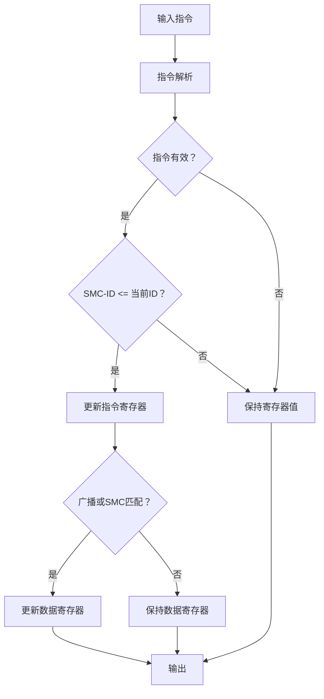

# SHIFT_UP 模块设计规格文档

>**文档版本**：V1.0  
>**作者**：Oliver  
>**创建日期**：2025年8月12日  
>**最后更新**：2025年8月12日  

## 1. 概述

### 1.1 模块功能

SHIFT_UP 模块是一个用于处理上行指令和数据的分发系统组件，实现指令的分发、数据的广播和指定 SMC 的更新功能。

### 1.2 设计目标

- 支持多 SMC-ID 的指令分发
- 实现广播机制
- 提供低延迟的数据路径
- 确保复位状态下的安全操作
- 实现精确的时序控制

## 2. 接口规格

### 2.1 顶层模块接口

```verilog
module shift_up #(
    parameter PARAM_UR_WORD_CNT = 4,    // 用户寄存器的字数（每字32bit）
    parameter SMC_ID = 0                // 模块的SMC-ID
)(
    input wire clk,                     // 时钟输入
    input wire rst_n,                   // 异步复位（低有效）
    input wire [134:0] cru_shiftup_in,  // 上行指令寄存器（135位）
    output wire [127:0] dr_shiftup_out, // 输出数据寄存器（128位）
    output wire [134:0] cru_shiftup_out // 输出指令寄存器（135位）
);
```

### 2.2 信号定义

| 信号名 | 位宽 | 方向 | 功能描述 |
|--------|------|------|----------|
| clk | 1 | Input | 系统时钟 |
| rst_n | 1 | Input | 异步复位信号（低电平有效） |
| cru_shiftup_in | 135 | Input | 输入指令寄存器 |
| dr_shiftup_out | 128 | Output | 输出数据寄存器 |
| cru_shiftup_out | 135 | Output | 输出指令寄存器 |

### 2.3 指令格式

#### CRU_SHIFTUP_IN 格式

- **位 134**：指令有效标志（1'b1：有效，1'b0：无效）
- **位 [133:6]**：128位数据
- **位 [5:1]**：5位目标 SMC-ID
- **位 0**：广播标志（1'b0：不广播，1'b1：广播）

## 3. 功能规格

### 3.1 核心功能

- **指令分发**：根据目标 SMC-ID 分发指令
- **数据广播**：广播模式下向所有 SMC 输出数据
- **寄存器更新**：在时钟上升沿更新输出寄存器
- **复位处理**：复位时清零所有寄存器

### 3.2 操作模式

#### 3.2.1 正常操作模式

- 当 `vld_in = 1'b1` 且 `SMC_ID >= smc_id_in` 时：
  - 更新输出指令寄存器 `cru_shiftup_out`
  - 如果满足以下任一条件，更新输出数据寄存器：
    - 广播模式 (`broadcast_in = 1'b1`)
    - 目标 SMC 匹配 (`SMC_ID == smc_id_in`)

#### 3.2.2 复位模式

- 当 `rst_n = 1'b0` 时：
  - 输出指令寄存器清零
  - 输出数据寄存器清零
  - 忽略所有输入指令

## 4. 架构设计

### 4.1 模块结构



### 4.2 关键组件

1. **指令解析单元**：
   - 分解135位输入指令
   - 提取有效标志、数据、SMC-ID和广播标志

2. **指令分发逻辑**：
   - 基于SMC-ID比较的指令路由
   - 广播模式检测

3. **寄存器更新逻辑**：
   - 同步寄存器更新
   - 复位状态处理

4. **数据路径**：
   - 组合逻辑选择当前数据源
   - 寄存器输出稳定数据

## 5. 验证规格

### 5.1 覆盖率目标

- 行覆盖率：100%
- 条件覆盖率：≥90%
- 翻转覆盖率：≥90%

## 6. 文档交付

### 6.1 设计文档

- [RTL 源代码](./vsrc/shift_up.v)
- [测试平台代码](./vsrc/tb_shift_up.v)

### 6.2 验证文档

- 测试计划与用例
- 覆盖率报告
- 仿真波形
- 时序分析报告

## 7. 快速上手

```bash
# 1. 获取文件
shift_up.v
tb_shift_up.v

# 2. 一键运行
chmod +x run_sim.sh
./run_sim.sh
cd sim_output
urg -dir simv.vdb -format both -report coverage_report

# 3. 查看结果
sim_output\coverage_report\dashboard.html
```

---
